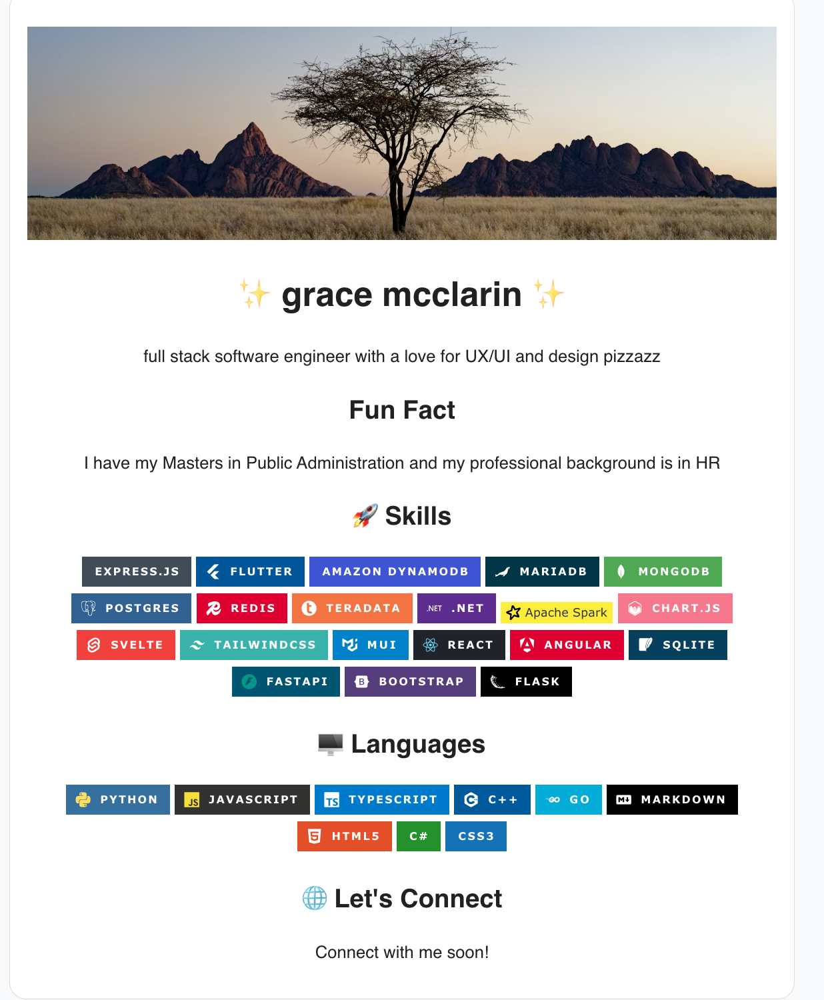

<h1 align="center">Github README Profile Generator</h1>
<p align="center"><strong>Easily generate a fun github readme</strong></p>


## 🛠️ Getting Started

```sh
# Clone the repo
git clone https://github.com/yourusername/github-profile-generator.git
```
```sh
# Install dependencies
cd github-profile-generator
npm install
```

```sh
# Start the development server
npm run dev
```

## 📸 Preview
<p align="center"></p>


## Live Project
[Live Project](https://generate-github-profile-readme.netlify.app/)

## License
MIT License.  
Feel free to use, remix, or contribute!
